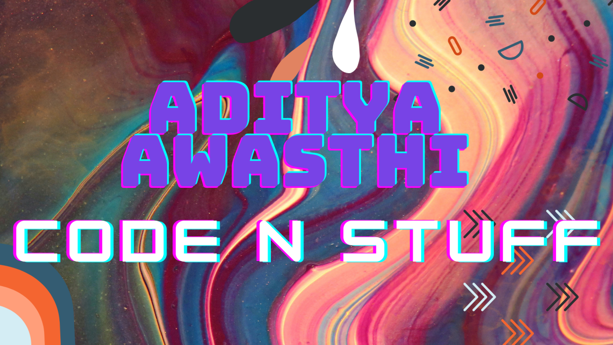
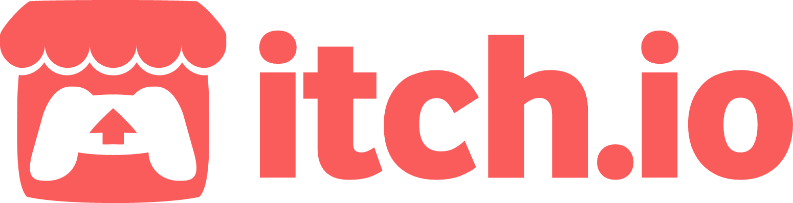
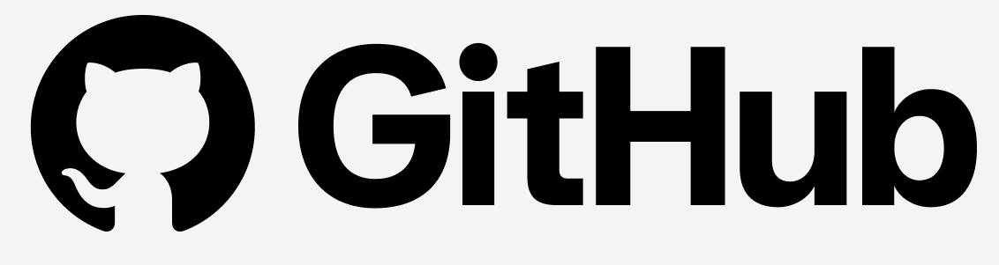

<h1>
Hi 👋, I’m @TheSimpleProgram AKA Aditya Awasthi
</h1>
<h2>
 Student, Developer from Earth</h2>

- 🖋️ Learning, about life.
- 👨‍💻 All of my projects are available on [My personal website](https://thesimpleprogram.github.io/AdityaAwasthi/).
- 🔭 You can find the games I made [here](https://adityaawasthi.itch.io/). PS more to come in future.
- 👀 I’m interested to create new projects especially in Python and HTML.
- 🌱 I’m currently working on a Reddit bot and a blogging site. 
- 📝 Maintaing a YouTube channel, where all my progress will be published. Will be uploaded soon.
- 🗿 Thanks for visiting my profile, have a great day ahead.

<!---
TheSimpleProgram/TheSimpleProgram is a ✨ special ✨ repository because its `README.md` (this file) appears on your GitHub profile.
You can click the Preview link to take a look at your changes.
--->
